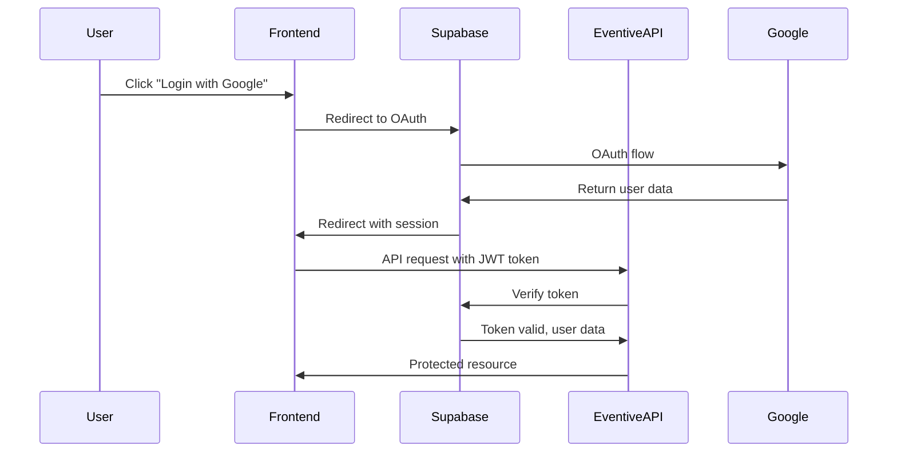

# Authentication Endpoints

OAuth authentication and token management endpoints.

## Overview

EventiveAPI uses Supabase Auth for OAuth-based authentication with Google and Discord providers. The frontend handles OAuth redirects, and tokens are used for subsequent API requests.

## Authentication Flow



## Endpoints

### Refresh Token

Refresh an expired access token using a refresh token.

```http
POST /api/auth/refresh
```

**Request Body:**

```json
{
  "refresh_token": "string"
}
```

**Response:** `200 OK`

```json
{
  "success": true,
  "data": {
    "access_token": "eyJhbGciOiJIUzI1NiIsInR5cCI6IkpXVCJ9...",
    "refresh_token": "v1.abc123...",
    "expires_in": 3600,
    "token_type": "bearer"
  }
}
```

**Error Response:** `401 Unauthorized`

```json
{
  "success": false,
  "error": {
    "message": "Invalid or expired refresh token"
  }
}
```

---

### Sign Out

Sign out the current user and invalidate their tokens.

```http
POST /api/auth/logout
Authorization: Bearer {access_token}
```

**Response:** `200 OK`

```json
{
  "success": true,
  "message": "Successfully signed out"
}
```

**Error Response:** `401 Unauthorized`

```json
{
  "success": false,
  "error": {
    "message": "No authorization token provided"
  }
}
```

---

### Get Current Session

Verify the current session and get user information.

```http
GET /api/auth/session
Authorization: Bearer {access_token}
```

**Response:** `200 OK`

```json
{
  "success": true,
  "data": {
    "user": {
      "id": "550e8400-e29b-41d4-a716-446655440000",
      "email": "user@example.com",
      "role": "user",
      "created_at": "2025-01-15T10:30:00Z"
    },
    "expires_at": 1735214400
  }
}
```

**Error Response:** `401 Unauthorized`

```json
{
  "success": false,
  "error": {
    "message": "Invalid or expired token"
  }
}
```

## Authentication Middleware

All protected endpoints require a valid JWT token in the Authorization header:

```http
Authorization: Bearer {your_access_token}
```

### How It Works

1. **Frontend obtains token** from Supabase Auth
2. **Frontend includes token** in API requests
3. **Backend validates token** with Supabase
4. **Backend attaches user info** to request object
5. **Route handler accesses** `req.user`

### Example Request

```javascript
// Frontend: Get token from Supabase
const { data: { session } } = await supabase.auth.getSession()
const token = session?.access_token

// Make authenticated request
const response = await fetch('http://localhost:3001/api/users/me', {
  headers: {
    'Authorization': `Bearer ${token}`,
    'Content-Type': 'application/json'
  }
})
```

## Error Codes

| Status | Code | Description |
|--------|------|-------------|
| 401 | `UNAUTHORIZED` | Missing or invalid token |
| 401 | `TOKEN_EXPIRED` | Token has expired |
| 403 | `FORBIDDEN` | Valid token but insufficient permissions |
| 429 | `RATE_LIMIT_EXCEEDED` | Too many requests |

## Rate Limiting

Authentication endpoints are rate-limited to prevent abuse:

- **Refresh Token**: 10 requests per minute per IP
- **Sign Out**: 30 requests per minute per IP
- **Session Check**: 60 requests per minute per IP

## Security Considerations

::: warning Important
- Tokens should be stored securely (never in localStorage for production)
- Always use HTTPS in production
- Implement token refresh before expiry
- Clear tokens on sign out
- Don't log tokens or include in error messages
:::

### Token Storage Recommendations

**Development:**
- Memory or sessionStorage is acceptable

**Production:**
- Use httpOnly cookies (server-side)
- Or secure, encrypted storage
- Implement PKCE flow for additional security

## OAuth Provider Setup

### Google OAuth

1. **Create project** in Google Cloud Console
2. **Enable Google+ API**
3. **Create OAuth 2.0 credentials**
4. **Add authorized redirect URIs**:
   ```
   https://your-project.supabase.co/auth/v1/callback
   ```
5. **Configure in Supabase**:
   - Go to Authentication → Providers
   - Enable Google
   - Add Client ID and Client Secret

### Discord OAuth

1. **Create application** in Discord Developer Portal
2. **Go to OAuth2 settings**
3. **Add redirect URL**:
   ```
   https://your-project.supabase.co/auth/v1/callback
   ```
4. **Configure in Supabase**:
   - Go to Authentication → Providers
   - Enable Discord
   - Add Client ID and Client Secret

## Testing

### Using cURL

```bash
# Refresh token
curl -X POST http://localhost:3001/api/auth/refresh \
  -H "Content-Type: application/json" \
  -d '{"refresh_token": "your-refresh-token"}'

# Sign out
curl -X POST http://localhost:3001/api/auth/logout \
  -H "Authorization: Bearer your-access-token"

# Check session
curl -X GET http://localhost:3001/api/auth/session \
  -H "Authorization: Bearer your-access-token"
```

### Using Frontend

```typescript
import { supabase } from './lib/supabaseClient'

// Get current session
const { data: { session } } = await supabase.auth.getSession()

// Make authenticated request
const response = await fetch('http://localhost:3001/api/users/me', {
  headers: {
    'Authorization': `Bearer ${session?.access_token}`
  }
})

// Sign out
await supabase.auth.signOut()
```

## Related Documentation

- [User Endpoints](/eventive-api/api/users) - User management API
- [Security Guide](/eventive-api/security/authentication) - Security best practices
- [Frontend Auth](/eventive/git/safety/authentication) - Frontend implementation

---

**Need help?** Check the [Troubleshooting Guide](/eventive-api/development/troubleshooting) or [open an issue](https://github.com/Juno-Labs-Team/EventiveAPI/issues).
